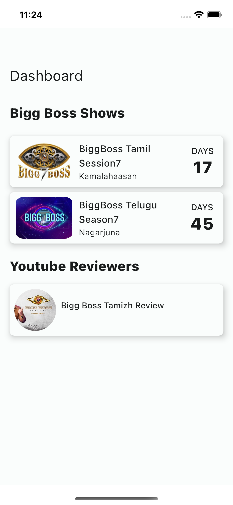
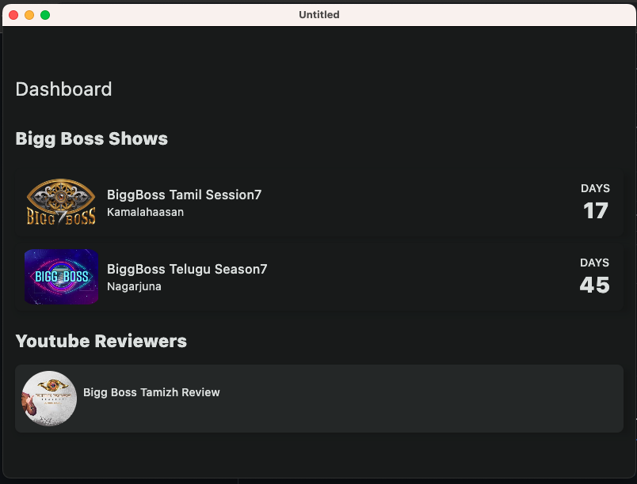
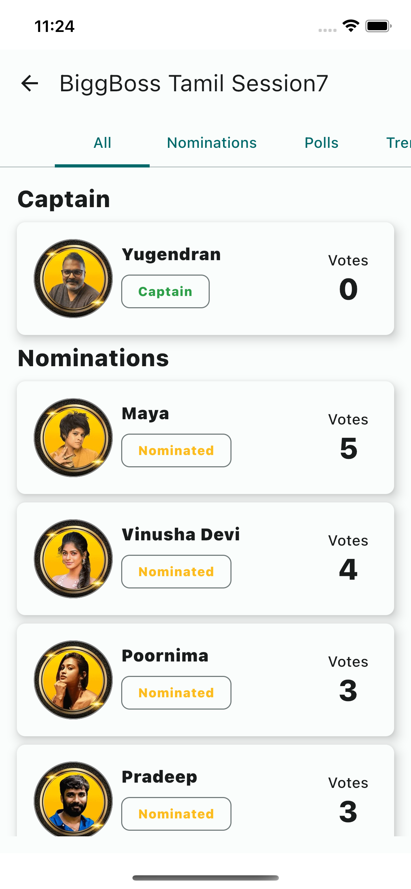
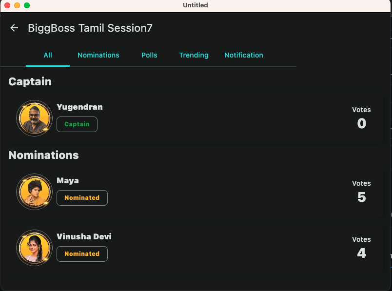
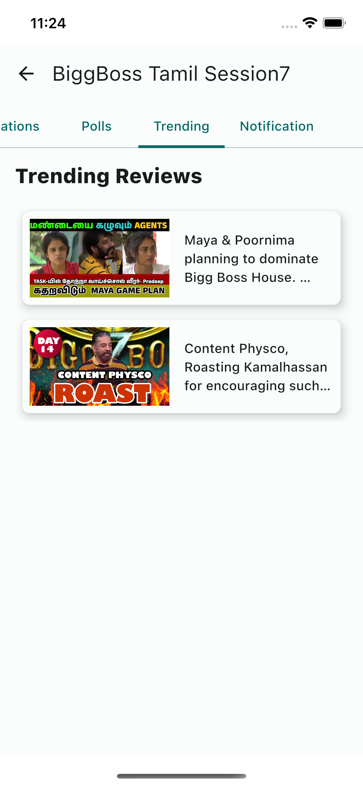
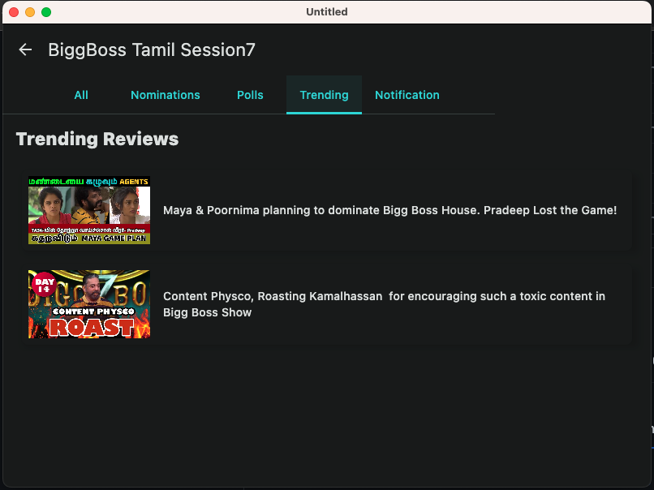

> **Note**
> Ultimate aim of this project is to educate professionals about Compose Multiplatform framework. This source is been deployed in to play store in the following link.
> Hence, redeploying this source with difference name is a recommended suggestion from our end. However, you are free to use this code as per your business needs.

Android Play Store link [Bigg Boss Tamil 7 Live Voting](https://play.google.com/store/apps/details?id=com.piappstudio.biggboss)

we made a Tutorials to explan this concepts, please check out this Playlist too
[ Bigg Boss App Development](Compose Multiplatform: https://www.youtube.com/playlist?list=PL8u30_s78ZuGobTKbQbP6nN-cX97Bo0Lb)

## Screenshots:
### Home

### Contestant List

### Trending

